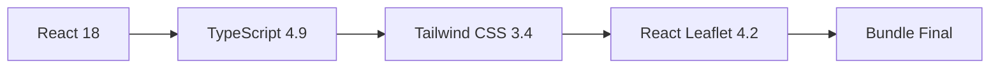
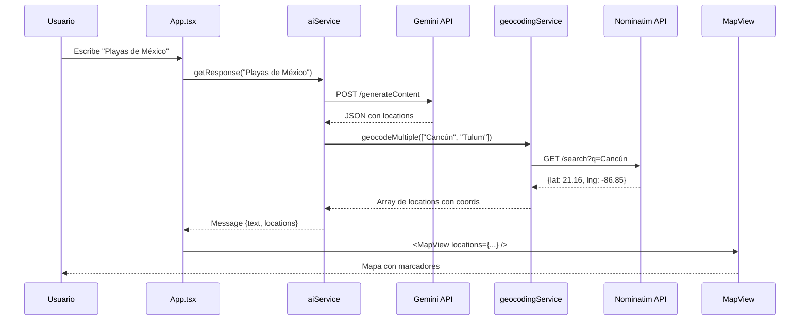

<div align="center">

# 🌍 Trip Recommendator

### *Tu asistente inteligente de viajes con IA*

[](https://reactjs.org/)
[](https://www.typescriptlang.org/)
[](https://tailwindcss.com/)
[](https://ai.google.dev/)
[](https://www.docker.com/)


[🚀 Demo en Vivo](#) • [📖 Documentación](#-tabla-de-contenidos) • [🐛 Reportar Bug](https://github.com/tu-usuario/trip-recommendator/issues) • [✨ Solicitar Feature](https://github.com/tu-usuario/trip-recommendator/issues)

</div>

---

## 📋 Tabla de Contenidos

- [✨ Características](#-características)
- [🎯 ¿Qué hace este proyecto?](#-qué-hace-este-proyecto)
- [🛠️ Tecnologías](#️-tecnologías)
- [🚀 Inicio Rápido](#-inicio-rápido)
- [📚 Uso](#-uso)
- [🏗️ Arquitectura](#️-arquitectura)
- [🔧 Configuración Avanzada](#-configuración-avanzada)
- [📖 Guía para Principiantes](#-guía-para-principiantes)
- [🤝 Contribuir](#-contribuir)
- [📄 Licencia](#-licencia)

---

## ✨ Características

<div align="center">

| 🎨 Interfaz Moderna | 🤖 IA Integrada | 🗺️ Mapas Interactivos | 🌙 Modo Oscuro |
|:---:|:---:|:---:|:---:|
|  |  |  |  |

</div>

### 🎯 Funcionalidades Principales

- 💬 **Chat Conversacional**: Pregunta sobre destinos y recibe recomendaciones personalizadas
- 🗺️ **Visualización de Mapas**: Marcadores interactivos con información detallada
- 🌍 **Geocodificación Automática**: Convierte nombres de lugares en coordenadas GPS
- 💾 **Persistencia de Datos**: Historial de conversaciones guardado en localStorage
- 🌙 **Tema Claro/Oscuro**: Cambia entre modos con un solo click
- 🎨 **Animaciones Fluidas**: Transiciones suaves y efectos visuales modernos
- 📱 **Diseño Responsivo**: Funciona perfectamente en móvil, tablet y desktop
- 🚀 **Sugerencias Rápidas**: Chips con destinos populares para comenzar
- 🐳 **Dockerizado**: Despliega con un solo comando

---

## 🎯 ¿Qué hace este proyecto?

**Trip Recommendator** es una aplicación web que combina inteligencia artificial con mapas interactivos para ayudarte a descubrir destinos de viaje. 

### 🌟 Flujo de Uso

```
1. Usuario: "Quiero ir a playas tropicales"
         ↓
2. IA procesa con Google Gemini
         ↓
3. Respuesta: "Te recomiendo Cancún, Tulum, Phuket..."
         ↓
4. Geocodificación automática de coordenadas
         ↓
5. Mapa muestra marcadores interactivos
```

### 📸 Capturas de Pantalla

<details>
<summary>🖼️ Ver capturas (click para expandir)</summary>

#### Modo Claro


#### Modo Oscuro


#### Vista Móvil


</details>

---

## 🛠️ Tecnologías

### Frontend Stack



| Tecnología | Versión | Propósito |
|------------|---------|-----------|
| **React** | 18.3.1 | Framework principal de UI |
| **TypeScript** | 4.9.5 | Tipado estático y seguridad |
| **Tailwind CSS** | 3.4.18 | Diseño y estilos responsivos |
| **Leaflet** | 1.9.4 | Mapas interactivos |
| **React Leaflet** | 4.2.1 | Integración React + Leaflet |

### Backend & APIs

| Servicio | Propósito |
|----------|-----------|
| **Google Gemini 2.5** | Generación de recomendaciones con IA |
| **Nominatim (OpenStreetMap)** | Geocodificación de nombres a coordenadas |

### DevOps

- 🐳 **Docker** + **Docker Compose**: Containerización
- 📦 **npm**: Gestión de paquetes
- 🔨 **Makefile**: Automatización de tareas

---

## 🚀 Inicio Rápido

### Prerrequisitos

```bash
# Versiones mínimas requeridas
node >= 18.x
npm >= 9.x
docker >= 24.x (opcional)
```

### 1️⃣ Clonar el Repositorio

```bash
git clone https://github.com/tu-usuario/trip-recommendator.git
cd trip-recommendator/ex00
```

### 2️⃣ Configurar Variables de Entorno

Crea un archivo `.env` en la carpeta `ex00/`:

```bash
# ex00/.env
REACT_APP_GEMINI_API_KEY=tu_api_key_aquí
```

<details>
<summary>🔑 ¿Cómo obtener una API Key de Google Gemini?</summary>

1. Visita [Google AI Studio](https://makersuite.google.com/app/apikey)
2. Inicia sesión con tu cuenta de Google
3. Haz click en **"Get API Key"**
4. Copia la key y pégala en `.env`

**Nota**: La API de Gemini tiene una capa gratuita generosa (60 requests/minuto).

</details>

### 3️⃣ Opción A: Ejecutar con Docker (Recomendado)

```bash
# Construir y ejecutar
make rebuild
make dev

# O en un solo paso
make rebuild && make dev
```

La aplicación estará disponible en **http://localhost:3000**

### 4️⃣ Opción B: Ejecutar Localmente (Sin Docker)

```bash
# Instalar dependencias
npm install

# Iniciar servidor de desarrollo
npm start
```

---

## 📚 Uso

### Comandos del Makefile

```bash
make help          # Ver todos los comandos disponibles
make up            # Iniciar contenedores en background
make dev           # Iniciar + ver logs en tiempo real
make down          # Detener contenedores
make restart       # Reiniciar rápido (para ver cambios)
make rebuild       # Reconstruir desde cero
make clean         # Limpiar TODO (reset nuclear)
make logs          # Ver logs en tiempo real
make shell         # Entrar al contenedor
```

### Flujo de Trabajo Recomendado

```bash
# 1. Primera vez
make rebuild
make dev

# 2. Desarrollo diario
make up
# Editar código...
make restart       # Ver cambios
# Ctrl+Shift+R en navegador

# 3. Si algo falla
make clean
make rebuild
```

### Ejemplo de Uso en la App

1. **Escribe una pregunta**:
   ```
   "Quiero ir a playas paradisíacas en Asia"
   ```

2. **IA responde**:
   ```
   Te recomiendo: Phuket (Tailandia), Bali (Indonesia), 
   Maldivas, Boracay (Filipinas)
   ```

3. **Mapa muestra**:
   - 📍 4 marcadores con colores únicos
   - 🔵 Círculos de radio alrededor
   - 📋 Popup con información al hacer click

---

## 🏗️ Arquitectura

### Diagrama de Componentes

```
┌─────────────────────────────────────────────────────────┐
│                    NAVEGADOR WEB                        │
│  ┌───────────────────────────────────────────────────┐  │
│  │  index.html                                       │  │
│  │  <div id="root"></div>  ← React se inyecta aquí   │  │
│  └────────────────┬──────────────────────────────────┘  │
│                   ↓                                     │
│  ┌───────────────────────────────────────────────────┐  │
│  │  App.tsx (Componente Principal)                   │  │
│  │  - Estado (messages, darkMode, showMap)           │  │
│  │  - Lógica de chat                                 │  │
│  │  - Renderiza UI                                   │  │
│  └────────────────┬──────────────────────────────────┘  │
│                   ↓                                     │
│  ┌───────────────────────────────────────────────────┐  │
│  │  MapView.tsx                                      │  │
│  │  - Recibe locations                               │  │
│  │  - Dibuja marcadores                              │  │
│  └────────────────┬──────────────────────────────────┘  │
│                   ↓                                     │
│  ┌───────────────────────────────────────────────────┐  │
│  │  Services                                         │  │
│  │  ┌─────────────────┬─────────────────────┐        │  │
│  │  │ aiService.ts    │ geocodingService.ts │        │  │
│  │  │ - API Gemini    │ - API Nominatim     │        │  │
│  │  └─────────────────┴─────────────────────┘        │  │
│  └───────────────────────────────────────────────────┘  │
└─────────────────────────────────────────────────────────┘
```

### Estructura de Carpetas

```
ex00/
├── public/
│   └── index.html              # HTML base
├── src/
│   ├── Components/
│   │   └── MapView.tsx         # Componente de mapa
│   ├── services/
│   │   ├── aiService.ts        # Cliente API Gemini
│   │   └── geocodingService.ts # Cliente API Nominatim
│   ├── types/
│   │   └── index.ts            # Interfaces TypeScript
│   ├── App.tsx                 # Componente principal
│   ├── index.tsx               # Punto de entrada
│   └── index.css               # Estilos globales
├── .env                        # Variables de entorno (NO commitear)
├── Dockerfile                  # Configuración Docker
├── docker-compose.yml          # Orquestación contenedores
├── Makefile                    # Comandos automatizados
├── package.json                # Dependencias npm
├── tailwind.config.js          # Configuración Tailwind
└── tsconfig.json               # Configuración TypeScript
```

### Flujo de Datos



---

## 🔧 Configuración Avanzada

### Personalizar el Modelo de IA

Edita `ex00/src/services/aiService.ts`:

```typescript
class AIService {
  private modelName: string = 'models/gemini-2.5-flash'; // Cambia aquí
  
  // Otros modelos disponibles:
  // - models/gemini-1.5-pro
  // - models/gemini-pro
}
```

### Cambiar Estilo del Mapa

Edita `ex00/src/Components/MapView.tsx`:

```typescript
// Modo claro (actual): OpenStreetMap
const tileUrl = 'https://{s}.tile.openstreetmap.org/{z}/{x}/{y}.png';

// Opciones alternativas:
// 1. Estilo satélite
const tileUrl = 'https://server.arcgisonline.com/ArcGIS/rest/services/World_Imagery/MapServer/tile/{z}/{y}/{x}';

// 2. Estilo oscuro (CartoDB Dark)
const tileUrl = 'https://{s}.basemaps.cartocdn.com/dark_all/{z}/{x}/{y}{r}.png';

// 3. Estilo acuarela (Watercolor)
const tileUrl = 'https://stamen-tiles-{s}.a.ssl.fastly.net/watercolor/{z}/{x}/{y}.jpg';
```

### Variables de Entorno Completas

```bash
# ex00/.env

# API Keys
REACT_APP_GEMINI_API_KEY=tu_key_aqui

# Docker (Opcional)
NODE_ENV=development
CHOKIDAR_USEPOLLING=true
WATCHPACK_POLLING=true
WDS_SOCKET_HOST=localhost
WDS_SOCKET_PORT=3000
FAST_REFRESH=true
```

---

## 📖 Guía para Principiantes

<details>
<summary>🎓 Entendiendo React + TypeScript (Click para expandir)</summary>

### 🧩 Analogía con C/C++

Si vienes de **C/C++**, aquí está la traducción:

| C/C++ | React/TypeScript |
|-------|------------------|
| `int main()` | `index.tsx` (punto de entrada) |
| `class App { render() }` | `function App() { return <div>... }` |
| `vector<Message> messages` | `useState<Message[]>([])` |
| `messages.push_back(msg)` | `setMessages([...msgs, msg])` |
| `drawText("Hello")` | `<p>Hello</p>` |
| `if (clicked) handle()` | `<button onClick={handle}>` |

### 📦 Conceptos Clave

#### 1. **Componentes** (Como funciones que devuelven UI)

```tsx
// En C++ dibujabas así:
void drawButton() {
  drawRect(x, y, w, h);
  drawText("Click me");
}

// En React es así:
function Button() {
  return <button>Click me</button>;
}
```

#### 2. **Estado** (Variables reactivas)

```tsx
// En C++ cambias una variable y llamas render():
int count = 0;
count++;
render();

// En React es automático:
const [count, setCount] = useState(0);
setCount(count + 1); // ← React re-renderiza solo
```

#### 3. **Props** (Parámetros de componentes)

```tsx
// En C++ pasas parámetros:
void drawMap(vector<Location> locs) { ... }

// En React:
function MapView({ locations }: Props) { ... }
```

#### 4. **Eventos** (Callbacks)

```tsx
// En C++ detectas clicks:
if (mouse.clicked(buttonRect)) {
  handleClick();
}

// En React:
<button onClick={handleClick}>
```

### 🔄 Flujo Completo de un Mensaje

```
1. Usuario escribe "Playas" → onChange actualiza inputText
2. Usuario presiona Enter → handleSend() ejecuta
3. setMessages([...messages, userMsg]) → React re-dibuja chat
4. aiService.getResponse() → Llama API Gemini
5. API responde JSON → aiService parsea
6. geocodingService.geocodeMultiple() → Obtiene coords
7. setMessages([...messages, aiResponse]) → React re-dibuja
8. MapView recibe locations → Leaflet dibuja marcadores
```

### 📚 Recursos para Aprender

- [React Docs Oficial](https://react.dev/learn)
- [TypeScript Handbook](https://www.typescriptlang.org/docs/handbook/intro.html)
- [Tailwind CSS Docs](https://tailwindcss.com/docs)
- [Leaflet Tutorial](https://leafletjs.com/examples.html)

</details>

<details>
<summary>🗺️ Cómo Funciona el Mapa (Click para expandir)</summary>

### Flujo de Renderizado del Mapa

```
1. MapView recibe locations: [{name: "Cancún", lat: 21.16, lng: -86.85}]
                ↓
2. Filtra locations válidas (con lat/lng numéricos)
                ↓
3. Calcula centro: promedio de todas las coordenadas
                ↓
4. MapContainer renderiza mapa base (OSM tiles)
                ↓
5. Por cada location:
   - Crear icono SVG con color único
   - Dibujar Marker en [lat, lng]
   - Agregar Popup con información
   - Dibujar Circle (radio 50km)
                ↓
6. FitBounds ajusta zoom para mostrar todos los marcadores
```

### Personalizar Marcadores

```tsx
// Cambiar colores de marcadores
const colors = [
  '#3B82F6', // Azul
  '#8B5CF6', // Púrpura
  '#EC4899', // Rosa
  '#10B981', // Verde
  '#F59E0B', // Ámbar
  '#EF4444', // Rojo
];

// Cambiar radio del círculo (en metros)
<Circle radius={50000} /> // 50km
<Circle radius={100000} /> // 100km
```

</details>

<details>
<summary>🤖 Cómo Funciona la IA (Click para expandir)</summary>

### Proceso de Generación de Respuesta

```
1. Usuario: "Quiero ir a playas tropicales"
         ↓
2. aiService crea prompt para Gemini:
   "Eres un asistente de viajes. Usuario pregunta: '...'
   Devuelve JSON: {text: '...', locations: [...]}"
         ↓
3. POST a Gemini API con prompt
         ↓
4. Gemini responde:
   {
     "text": "Te recomiendo...",
     "locations": [
       {"name": "Cancún, México", "lat": 21.16, "lng": -86.85}
     ]
   }
         ↓
5. aiService extrae JSON con regex
         ↓
6. Si faltan coordenadas → geocodingService las obtiene
         ↓
7. Retorna Message {sender: 'ai', text, locations}
```

### Modo Mock (Sin API Key)

Si no configuras `REACT_APP_GEMINI_API_KEY`, el servicio usa respuestas hardcodeadas:

```typescript
if (userMessage.includes('playa')) {
  return {
    text: "Te propongo Cancún, Tulum...",
    locations: [
      {name: "Cancún", lat: 21.16, lng: -86.85}
    ]
  };
}
```

</details>

---

## 🤝 Contribuir

¡Las contribuciones son bienvenidas! Sigue estos pasos:

### 1. Fork el Proyecto

```bash
# Click en "Fork" en GitHub
# Luego clona tu fork:
git clone https://github.com/tu-usuario/trip-recommendator.git
```

### 2. Crea una Rama

```bash
git checkout -b feature/nueva-funcionalidad
```

### 3. Haz Cambios y Commit

```bash
git add .
git commit -m "✨ Agrega nueva funcionalidad X"
```

### 4. Push y Crea Pull Request

```bash
git push origin feature/nueva-funcionalidad
# Luego abre un Pull Request en GitHub
```

### 📝 Guía de Estilo

- **Commits**: Usa [Conventional Commits](https://www.conventionalcommits.org/)
  - `feat:` Nueva funcionalidad
  - `fix:` Corrección de bug
  - `docs:` Cambios en documentación
  - `style:` Cambios de formato (sin afectar código)
  - `refactor:` Refactorización de código
  - `test:` Agregar/modificar tests

- **Código**:
  - Usa TypeScript (no `any`)
  - Sigue eslint rules
  - Comenta código complejo

---


## 🙏 Agradecimientos

- [Google Gemini](https://ai.google.dev/) por la API de IA generativa
- [OpenStreetMap](https://www.openstreetmap.org/) por los datos de mapas
- [Leaflet](https://leafletjs.com/) por la librería de mapas
- [Tailwind CSS](https://tailwindcss.com/) por el sistema de diseño
- Comunidad de [React](https://react.dev/) y [TypeScript](https://www.typescriptlang.org/)

---

## 📞 Contacto

**Link del Proyecto**: [https://github.com/Escudo5/trip-recommendator](https://github.com/Escudo5/trip-recommendator)

---


<div align="center">

**⭐ Si te gusta este proyecto, dale una estrella en GitHub! ⭐**

Hecho con ❤️ por [Sergio](https://github.com/Escudo5)

</div>
